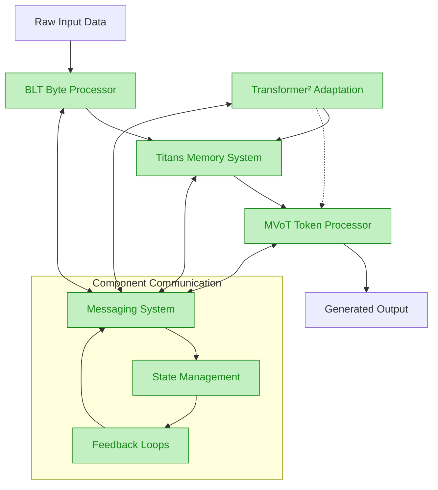
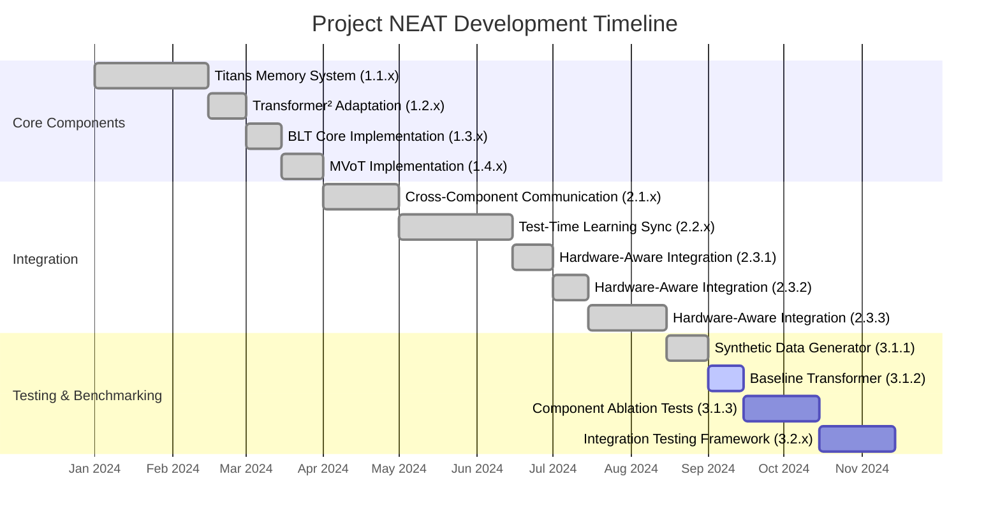
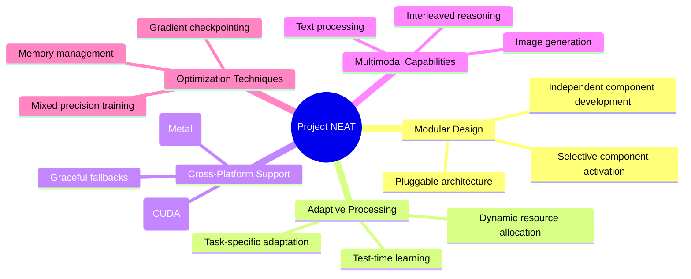
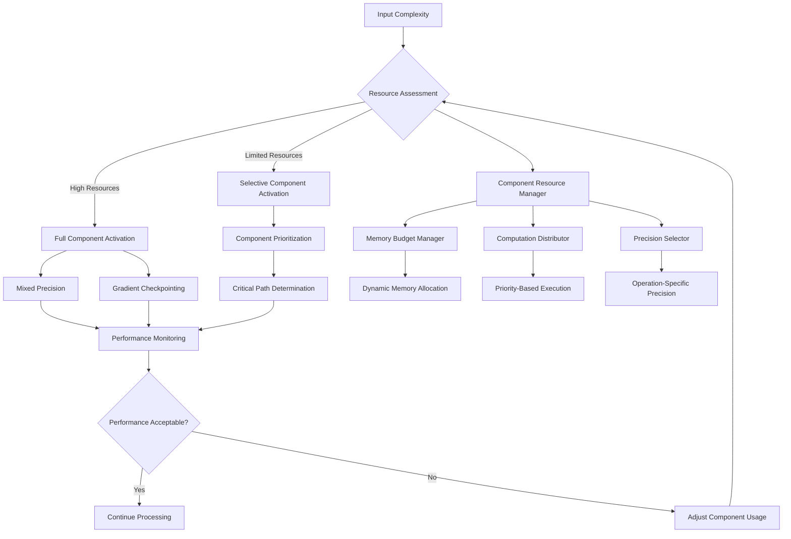

# Project NEAT: Neural Adaptive Transformers

<div align="center">
  

[](https://www.python.org/downloads/)
[](https://pytorch.org/)
[](LICENSE)

**A cutting-edge neural architecture combining several recent advanced techniques for an efficient, adaptive, and multimodal AI system.**

</div>

---

## 📑 Contents

- [Architecture Overview](#architecture-overview)
- [Current Status](#current-status)
- [Key Features](#key-features)
- [Technical Details](#technical-details)
- [Installation](#installation)
- [Usage](#usage)
- [Hardware Optimization](#hardware-optimization)
- [Project Structure](#project-structure)
- [References](#references)

---

## Architecture Overview

Project NEAT seamlessly integrates four groundbreaking neural architectures into a unified framework:

<div align="center">



</div>

<div align="center">

| Component | Description | Core Functionality |
|-----------|-------------|-------------------|
| **Titans** | Test-time learning with three-tiered memory | Memory updates based on surprise detection |
| **Transformer²** | Self-adaptive weight matrices using SVD | Two-pass inference with task adaptation |
| **MVoT** | Multimodal Visualization-of-Thought | Interleaved text-image reasoning |
| **BLT** | Byte-level transformer with dynamic patching | Entropy-based processing of raw bytes |

</div>

## Current Status

<div align="center">



</div>

### Completed Components
- ✅ **Titans Memory System** (1.1.x)
  - Three-tiered memory architecture (short-term, long-term, persistent)
  - Surprise-based memory updates using gradient magnitudes
  - Adaptive memory decay mechanisms based on context length
  - Gradient checkpointing for efficient memory usage

- ✅ **Transformer² Adaptation** (1.2.x)
  - SVD-based weight adaptation for efficient fine-tuning
  - Task embedding similarity matching for computation reuse
  - Two-pass inference process (dispatch and expert composition)
  - Randomized SVD for large matrix optimization

- ✅ **BLT Core Implementation** (1.3.x)
  - Entropy-based byte patching for dynamic processing
  - Variable-length patch handling with masking mechanism
  - Local-global-local architecture for efficient processing
  - Adaptive entropy threshold for computation/accuracy tradeoff

- ✅ **MVoT Implementation** (1.4.x)
  - Visual codebook integration supporting multiple VQ-VAE formats (1.4.1)
  - Text/image generation decision mechanism combining heuristic and neural approaches (1.4.2)
  - Byte-to-token mapping for BLT compatibility with bi-directional conversion (1.4.3)
  - Token discrepancy loss for high-quality visualizations

- ✅ **Cross-Component Communication** (2.1.x)
  - Message-based pub-sub architecture for loose coupling
  - Priority-based message processing for critical information
  - State tracking with subscriptions for reactive components
  - Feedback loops for coordinated processing (task-memory, surprise-adaptation, modality)

- ✅ **Test-Time Learning Synchronization** (2.2.x)
  - Coordinated gradient computation across components (2.2.1)
  - Adaptive learning rate management (2.2.2)
  - Test-time optimization monitoring (2.2.3)

- ✅ **Hardware-Aware Integration** (2.3.x)
  - Component-specific resource allocation and management (2.3.1)
  - Hardware capability adaptation (2.3.2)
  - Execution scheduling optimization (2.3.3)

- ✅ **Synthetic Data Generator** (3.1.1)
  - Mathematical problem generator with progressive difficulty levels
  - Component-specific problem types (Titans memory tests, Transformer² adaptation)
  - Controlled distribution shifts for evaluating generalization
  - Comprehensive test suite for data generation validation
  - Mock models for BLT entropy estimator and MVoT visual codebook
    
- 📅 **Upcoming: Testing & Evaluation** (3.x)
  - Baseline transformer implementation (3.1.2)
  - Component ablation testing (3.1.3)
  - Comprehensive benchmarking (3.2.x)
  - Deployment optimization (3.3.x)

## Key Features

<div align="center">



</div>

- **Modular Component Design**: Selective activation based on input complexity and available computational resources
- **Test-Time Learning**: Memory updates and weight adaptation during inference without requiring full model retraining
- **Cross-Platform Optimization**: Specialized support for both Apple Silicon (Metal) and NVIDIA (CUDA) with fallback mechanisms
- **Multimodal Processing**: Seamless handling of text and visual content with interleaved generation capabilities
- **Component Communication**: Loosely coupled architecture with message-based coordination between components

## Technical Details

### Titans Memory System

The Titans memory system implements three types of memory:

1. **Short-term Memory**: Window-based attention over recent tokens
2. **Long-term Memory**: Surprise-based memory updates
3. **Persistent Memory**: Task-agnostic knowledge

Memory updates are governed by a surprise-driven mechanism:

$$
M_t = (1 - \alpha) \cdot M_{t-1} + \alpha \cdot f(x_t, \nabla_{x_t}\mathcal{L})
$$

where $\alpha$ is determined by the surprise magnitude $\left\|\nabla_{x_t}\mathcal{L}\right\|$.

<details>
<summary><b>Click to expand implementation details</b></summary>

- Gradient-based surprise measurement using autograd
- Memory decay factor adapts based on context length
- Three memory interaction modes: concatenation, gating, and interpolation
- Recency, importance, and surprise factors balance memory updates
- Platform-agnostic gradient computation with Metal support

</details>

### Transformer² Adaptation

Transformer² implements weight adaptation using Singular Value Decomposition:

$$
W = U \cdot \text{diag}(\sigma) \cdot V^T
$$

The adaptation process modifies only the singular values:

$$
W_{\text{adapted}} = U \cdot \text{diag}(\sigma_{\text{base}} + \Delta\sigma) \cdot V^T
$$

where $\Delta\sigma$ is determined by the task embedding from a two-pass inference process.

<details>
<summary><b>Click to expand implementation details</b></summary>

- Randomized SVD for large matrices improves computation efficiency
- Task embeddings cached for similar inputs to avoid redundant computation
- Adaptive precision in SVD varies component count based on matrix properties
- Similarity threshold determines when to reuse previous adaptations
- Adaptation strength varies by layer depth and matrix characteristics

</details>

### MVoT Token Processor

MVoT enables interleaved text-image reasoning through token-level multimodal processing:

$$
v_i \sim P_\theta(v_i | z_1, v_1, \ldots, z_i)
$$

$$
z_{i+1} \sim P_\theta(z_{i+1} | x, z_1, v_1, \ldots, z_i, v_i)
$$

It incorporates a token discrepancy loss to improve visualization quality:

$$
L_D = \sum_{i=1}^n S_{t_{\text{vis}}^i} \cdot P(t_i)
$$

<details>
<summary><b>Click to expand implementation details</b></summary>

- Support for multiple VQ-VAE model formats (VQVAE, VQGAN, DALL-E)
- Lazy initialization of visual codebook to conserve memory
- Embedding space conversion between model hidden size and codebook dimensions
- Heuristic and neural approaches for text/image generation decisions
- Context-aware decision logic considers pattern of previous decisions
- Visualization count limiter prevents overuse of image generation

</details>

### BLT Byte Processor

BLT processes raw bytes using entropy-based dynamic patching:

$$
H(x_i) = -\sum_{v \in V} p_e(x_i = v \mid x_{i-1}) \cdot \log p_e(x_i = v \mid x_{i-1})
$$

Patches are formed when entropy exceeds a threshold, leading to a local-global-local processing pipeline:

$$
H_j = \text{LatentTransformer}(E_1, E_2, \ldots, E_j)
$$

$$
\hat{p}_j = \text{LocalDecoder}(H_j, E_j)
$$

<details>
<summary><b>Click to expand implementation details</b></summary>

- Byte-level entropy estimator with position embeddings
- Adaptive entropy threshold balances computation and accuracy
- Variable-length patch handling with proper masking
- Local encoder processes individual patches efficiently
- Latent transformer provides global context across patches
- Local decoder generates refined byte-level predictions
- Computation budget management through entropy thresholds

</details>

## Installation & Setup 💻 

### Requirements

- Python 3.9+
- PyTorch 2.0+
- CUDA 11.8+ (NVIDIA) or Metal (Apple Silicon)
- Platform support: macOS, Windows, Linux

### Installation

```bash
# Clone the repository
git clone https://github.com/yourusername/project-neat.git
cd project-neat

# Create a virtual environment
python3 -m venv venv
source venv/bin/activate  # On Windows: venv\Scripts\activate

# Install dependencies
pip install -r requirements.txt

# Optional: Install platform-specific dependencies
# For Apple Silicon
pip install torch torchvision torchaudio

# For NVIDIA GPUs
pip install torch torchvision torchaudio --index-url https://download.pytorch.org/whl/cu118
```

## Usage Examples 🛠️ 

### Training

```bash
# Train with all components enabled
python main.py --mode train \
    --use_titans_memory \
    --use_transformer2_adaptation \
    --use_mvot_processor

# Train with specific optimizations
python main.py --mode train \
    --mixed_precision \
    --gradient_checkpointing \
    --dynamic_resource_allocation
```

### Evaluation

```bash
# Evaluate a trained model
python main.py --mode eval \
    --model_path ./outputs/best_model

# Evaluate with specific metrics
python main.py --mode eval \
    --model_path ./outputs/best_model \
    --eval_metrics accuracy,perplexity,memory_efficiency
```

### Component Profiling

```bash
# Profile all components
python main.py --mode profile

# Profile specific components
python main.py --mode profile \
    --profile_components titans,transformer2,mvot

# Profile with hardware optimization
python main.py --mode profile --optimize_for_hardware
```

### Hardware Detection

```bash
# Detect hardware capabilities
python main.py --mode hardware_detection

# Show detailed hardware information
python main.py --detect_hardware --hardware_info

# Run hardware capability tests
python test_hardware_capabilities.py --test_all
```

### Testing

```bash
# Run all tests
python -m pytest tests/

# Run specific component tests
python -m pytest tests/test_components.py::TestName::test_method_name
```

## Hardware Optimization ⚡ 

<div align="center">



</div>

The implementation includes several performance optimization techniques:

1. **Component-Specific Resource Allocation** (Phase 2.3.1) - ✅
   - Memory Budget Manager for dynamic memory allocation across components
   - Computation Distributor for priority-based compute resource assignment
   - Precision Selector for operation-specific precision optimization
   - Resource-aware architecture with memory pressure detection

2. **Hardware Capability Adaptation** (Phase 2.3.2) - ✅
   - Unified hardware detection system for CUDA, MPS (Metal), and CPU capabilities
   - Progressive memory pressure monitoring with threshold-based component deactivation
   - Cross-platform compatibility layer providing fallbacks for unsupported operations
   - Platform-specific optimizations for SVD, attention mechanisms, and tensor operations
   - Robust memory usage profiling with accurate tracking across different devices
   - Optimal configuration recommendations based on detected hardware capabilities
   - Integration with main.py to automatically optimize for available hardware

3. **Execution Scheduling Optimization** (Phase 2.3.3) - ✅
   - Priority-based execution scheduling minimizing waiting time
   - Parallelization opportunity identification for concurrent execution
   - Adaptive batching based on component characteristics
   - Pipeline optimization to minimize idle time during execution
   - Performance benchmarking to measure optimization effectiveness
   - Work stealing algorithm for balanced multi-threaded execution
   - Directed acyclic graph (DAG) for dependency analysis and scheduling
   - Thread-safe concurrent data structures for robust multi-threaded operation

4. **Mixed Precision Training**
   - Uses FP16/BF16 computation with FP32 master weights
   - Automatically detects hardware capabilities and selects optimal precision
   - Operation-specific precision selection based on numerical requirements
   - Dynamic precision adaptation based on computation stability requirements

5. **Memory Optimization**
   - Gradient checkpointing for reduced memory footprint
   - Memory pressure monitoring and proactive reallocation
   - Priority-based memory allocation during resource constraints
   - Selective component deactivation under high memory pressure
   - Component importance scoring for resource prioritization

6. **Hardware-Specific Acceleration**
   - Metal support for Apple Silicon (M-series)
   - CUDA optimization for NVIDIA GPUs
   - Fallback mechanisms for CPU-only environments
   - Thread pool management for optimal CPU utilization
   - Platform-specific optimizations with unified API access

## Project Structure 📁

```
project-neat/
├── src/
│   ├── components/
│   │   ├── titans/                   # Titans memory system
│   │   │   └── memory_system.py      # Three-tiered memory implementation
│   │   ├── transformer2/             # Transformer² adaptation
│   │   │   └── adaptation.py         # SVD-based weight adaptation
│   │   ├── mvot/                     # MVoT token processor
│   │   │   ├── visual_codebook.py    # VQ-VAE integration
│   │   │   ├── token_processor.py    # Multimodal token processing
│   │   │   ├── decision/             # Decision mechanisms
│   │   │   └── mapping/              # Byte-token mapping
│   │   ├── blt/                      # BLT byte processor
│   │   │   ├── byte_processor.py     # Entropy-based patching
│   │   │   └── entropy_estimator_trainer.py # Byte-level entropy estimation
│   │   ├── feedback/                 # Component feedback mechanisms
│   │   │   ├── task_memory_feedback.py # Task-memory correlation
│   │   │   ├── adaptation_feedback.py  # Surprise-driven adaptation
│   │   │   └── modality_feedback.py    # Modality feedback
│   │   ├── learning/                 # Learning components
│   │   │   ├── adaptive_learning_rate.py # Dynamic learning rate management
│   │   │   ├── gradient_coordination.py  # Cross-component gradient management
│   │   │   └── optimization_monitoring.py # Test-time optimization quality
│   │   └── messaging/                # Component communication
│   │       ├── message_protocol.py   # Message passing system
│   │       └── component_state.py    # Component state tracking
│   ├── models/                       # Unified architecture
│   │   ├── unified_architecture.py   # Main architecture integration
│   │   ├── unified_architecture_resource_adapter.py # Resource-aware architecture
│   │   └── transformer.py            # Base transformer implementation
│   ├── trainers/                     # Training infrastructure
│   │   └── hardware_aware_trainer.py # Platform-specific training
│   ├── data/                         # Data handling
│   │   ├── synthetic/                # Synthetic data generation
│   │   │   └── math_generator.py     # Mathematical problem generator
│   │   └── loaders/                  # Data loading utilities
│   └── utils/                        # Utility functions
│       ├── config.py                 # Configuration handling
│       ├── memory_optimization.py    # Memory usage optimization
│       ├── component_resource_management.py # Component-specific resource allocation
│       ├── hardware_detection.py     # Hardware capability detection
│       ├── platform_compatibility.py # Cross-platform operation compatibility
│       ├── execution/                # Execution scheduling optimization
│       │   ├── scheduler.py          # Priority-based execution scheduler
│       │   ├── dependency_analyzer.py # Operation dependency analysis
│       │   ├── batch_optimizer.py    # Adaptive batch size optimization
│       │   ├── parallel_executor.py  # Parallel execution engine
│       │   └── benchmark.py          # Performance benchmarking utilities
│       └── execution_integration.py  # Integration with resource management
├── tests/                            # Test cases
│   ├── test_components.py            # Component-level tests
│   ├── test_integration.py           # Integration tests
│   ├── test_learning.py              # Learning system tests
│   ├── test_feedback.py              # Feedback mechanism tests
│   ├── test_messaging.py             # Messaging system tests
│   ├── test_component_resource_management.py # Resource management tests
│   ├── test_resource_aware_architecture.py  # Resource-aware architecture tests
│   ├── test_hardware_capability_adaptation.py # Hardware detection and adaptation tests
│   ├── test_execution_scheduling.py        # Execution scheduling tests
│   ├── test_execution_integration.py       # Execution integration tests
│   └── test_synthetic_data.py              # Synthetic data generator tests
├── docs/                             # Documentation
│   ├── PLAN_MAIN.MD                  # Project planning document
│   ├── TECHNICALd.md                 # Technical details and theory
│   ├── phase2.2.2-3_plan.md          # Hardware-aware integration plan
│   └── metal_docs.md                 # Apple Metal framework integration
├── scripts/                          # Helper scripts
│   ├── train_byte_lm.py              # BLT training script
│   ├── create_mock_models.py         # Mock model creation for testing
│   ├── setup_test_environment.sh     # Test environment setup script
│   ├── train_neat_model_mac.sh       # macOS-specific training script
│   └── test_advanced_problems.py     # Advanced problem type testing
└── main.py                           # Main script
```
## References

<div align="center">

| Paper | Core Concept | Implementation |
|-------|--------------|----------------|
| ["Titans: Learning to Memorize at Test Time"](https://arxiv.org/abs/2501.00663) | Test-time memory updates based on surprise detection | `src/components/titans/` |
| ["TRANSFORMER2: SELF-ADAPTIVE LLMS"](https://arxiv.org/html/2501.06252v2) | SVD-based weight adaptation through two-pass inference | `src/components/transformer2/` |
| ["Multimodal Visualization-of-Thought"](https://arxiv.org/abs/2501.07542) | Interleaved text-image reasoning with token discrepancy loss | `src/components/mvot/` |
| ["Byte Latent Transformer"](https://arxiv.org/abs/2412.09871) | Entropy-based byte patching with local-global-local architecture | `src/components/blt/` |

</div>

---

<div align="center">
<p>Project NEAT is licensed under the Apache 2.0 License - see the <a href="LICENSE">LICENSE</a> file for details.</p>
</div>
